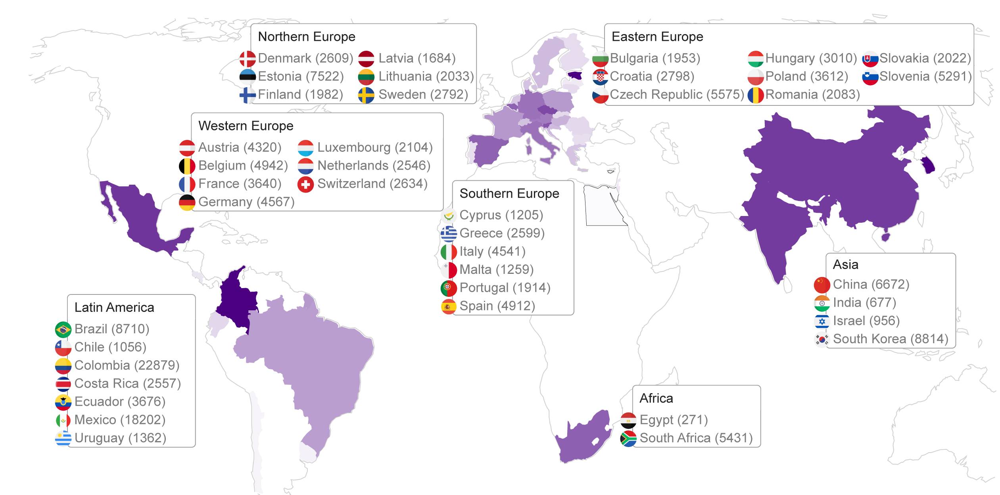

  

# 
Biobehavioral age gaps

# Table of Contents
- [Summary](#Summary)
- [Folder hierarchy](#Folderhierarchy)
- [Databases](#Databases)
- [General description](#Generaldescription)

  

## Summary

This repository contains the codes and databases necessary for the results of the study: "Biobehavioral age gaps, global disparities, and exposomes in accelerated aging: a cross-sectional and longitudinal analysis across 40 countries". Below are descriptions of the databases and scripts provided.

## Databases

  
*Figure: Distribution of countries in the study.*

The dataset includes 161,981 participants (45.09% females, mean age=67.06, SD=9.85, age range=51–90) from population-representative aging surveys across Latin America, Europe, Asia, and Africa. 

Additionally, a longitudinal subsample with two waves is included:  
- Wave 1: n=21,631 (42.31% females, mean age=67.18, SD=11.47, range=41–114)  
- Wave 2: n=21,631 (42.31% females, mean age=71.64, SD=10.47, range=41–117)  
This subsample includes participants from Latin America (Mexico, Costa Rica), Europe (Austria, Belgium, Czech Republic, Denmark, France, Germany, Greece, Italy, Poland, Spain, Sweden, Switzerland), and Asia (China, South Korea).  

In addition, there is a separate dataset from South Africa with two waves:  
- Wave 1: n=5,431 (42.07% females, mean age=45.69, SD=14.15, range=25–90)  
- Wave 2: n=5,431 (42.07% females, mean age=46.69, SD=14.10, range=26–91)  

The following table provides contact information and download links for all databases used in this study.

| Dataset | Countries | Contact/source |
|---------|-----------|----------------|
| National surveys on health, well-being and aging (SABE surveys) | Chile  Uruguay  Colombia  Ecuador  | [PubMed](https://pubmed.ncbi.nlm.nih.gov/16053641/) [PubMed](https://pubmed.ncbi.nlm.nih.gov/16053641/) [NCBI](https://www.ncbi.nlm.nih.gov/pmc/articles/PMC6774577) [INEC Ecuador](https://www.ecuadorencifras.gob.ec/encuesta-de-salud-bienestar-del-adulto-mayor/) |
| The Brazilian Longitudinal Study of Ageing (ELSI-Brazil) (2016) | Brazil  | [ELSI-Brazil](https://elsi.cpqrr.fiocruz.br/) |
| Costa Rican Study on Longevity and Healthy Aging (CRELES) | Costa Rica  | [CRELES](http://www.creles.berkeley.edu/index.html) |
| Encuesta Nacional sobre Salud y Envejecimiento en México (ENASEM) | Mexico | [ENASEM](https://enasem.org/Home/index_esp.aspx) |
| Chinese Longitudinal Healthy Longevity Survey Series | China  | [CHARLS](https://charls.pku.edu.cn/en/) |
| Korean Longitudinal Study of Aging (KLoSA) | South Korea  | [KLoSA](https://survey.keis.or.kr/eng/klosa/klosa01.jsp) |
| Survey of Health, Ageing and Retirement in Europe (SHARE) | Austria, Belgium, Bulgaria, Croatia, Cyprus, Czechia, Denmark, Estonia, Finland, France, Germany, Greece, Hungary, Italy, Latvia, Lithuania, Luxembourg, Malta, Netherlands, Poland, Portugal, Romania, Slovak Republic, Slovenia, Spain, Sweden, Switzerland  | [SHARE](https://www.share-eric.eu/) |
| Egipt Dataset | Egipt | mohamed-salama@aucegypt.edu |
| India Dataset | India | swati.bajpai@gbhi.org |
| South Africa Dataset | South Africa | cyprian.mostert@aku.edu |

### General description:

Each database includes subjects' age, sex, and education years. Those databases containing cognition data also provide subjects' Mini-Mental State Examination (MMSE) scores. Databases in the main_result directory encompass all subjects utilized in the study.

